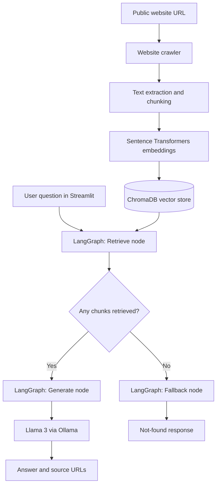

<div align="center">

# 🔎 Website RAG Assistant

### Ask questions about websites with a local, LangGraph-powered AI assistant

**Crawl websites · Search semantically · Generate grounded answers**


</div>

---

## ✨ Overview

**Website RAG Assistant** is a locally running Retrieval-Augmented Generation (RAG) application. Enter a public website URL, index its accessible pages, and ask questions about the site's content through a simple Streamlit interface.

The assistant uses **LangGraph** to coordinate retrieval, conditional routing, and response generation. **ChromaDB** stores vector embeddings, **Sentence Transformers** powers semantic search, and **Llama 3** runs locally through **Ollama** to answer questions using retrieved website context.

> **Privacy-friendly by design:** Website text and questions are processed locally after pages are fetched. No paid LLM API key is required. The embedding model may be downloaded from Hugging Face during initial setup.

## 🖥️ Preview

<!-- Add a screenshot to screenshots/app.png and uncomment the line below. -->
<!--  -->

*Screenshot coming soon: add a screenshot of the Streamlit interface to `screenshots/app.png` and uncomment the Markdown image above.*

## 🚀 Features

- **Dynamic website indexing:** Enter a public URL to crawl and index up to 10 accessible pages per indexing run.
- **Semantic search:** Split content into overlapping chunks and retrieve relevant passages using local embeddings and ChromaDB.
- **LangGraph orchestration:** Route each question through retrieval and conditionally generate an answer or return a fallback when no chunks are retrieved.
- **Local LLM inference:** Generate answers using Llama 3 through Ollama.
- **Source attribution:** Display URLs for retrieved passages used to support an answer.
- **Multiple indexed domains:** Select a previously indexed website in the Streamlit interface.
- **Persistent storage:** Reuse indexed content across application restarts with a local ChromaDB database.

## 🧠 Architecture



### How it works

1. **Index:** The crawler fetches accessible pages from the submitted website. Extracted text is split into overlapping chunks.
2. **Embed and store:** Sentence Transformers (`all-MiniLM-L6-v2`) creates embeddings, which are saved in ChromaDB with source URL and domain metadata.
3. **Retrieve:** A question triggers the LangGraph retrieval node, which searches the selected domain for the top matching chunks.
4. **Route:** LangGraph checks whether retrieval returned any chunks. If none are found, it uses the fallback node.
5. **Generate:** Otherwise, Llama 3 receives the question and retrieved context and generates a response. The interface displays the answer and source URLs when applicable.

> **Grounding note:** The model is instructed to use retrieved context, but answers should still be verified against the cited pages. The fallback checks whether chunks were retrieved; it does not independently verify factual relevance.

## 🛠️ Tech stack

| Layer | Technology |
| --- | --- |
| Application | Python, Streamlit |
| Workflow orchestration | LangGraph |
| Local language model | Llama 3 via Ollama |
| Embeddings | Sentence Transformers (`all-MiniLM-L6-v2`) |
| Vector database | ChromaDB |
| Web crawling | Requests, BeautifulSoup |

## ⚙️ Getting started

### Prerequisites

- Python 3.13 (the development environment used for this project)
- [Ollama](https://ollama.com/download) installed and running
- Git (optional, for cloning)

### 1. Clone the repository

```bash
git clone https://github.com/YOUR_USERNAME/YOUR_REPOSITORY.git
cd YOUR_REPOSITORY
```

Replace `YOUR_USERNAME` and `YOUR_REPOSITORY` with your actual GitHub details.

### 2. Create a virtual environment

**Windows PowerShell:**

```powershell
python -m venv .venv
.\.venv\Scripts\Activate.ps1
```

If PowerShell blocks activation, run `Set-ExecutionPolicy -Scope Process -ExecutionPolicy Bypass` in that terminal and try again.

**macOS / Linux:**

```bash
python3 -m venv .venv
source .venv/bin/activate
```

### 3. Install Python dependencies

```bash
pip install -r requirements.txt
```

Ensure your `requirements.txt` includes Streamlit, LangGraph, ChromaDB, Sentence Transformers, Ollama's Python client, Requests, and BeautifulSoup.

### 4. Download and start the local model

```bash
ollama pull llama3
```

Make sure the Ollama service is running. If needed, start it in a separate terminal:

```bash
ollama serve
```

### 5. Launch the app

```bash
streamlit run app.py
```

Streamlit will show a local URL, typically `http://localhost:8501`.

## 💬 Example usage

1. Enter `https://docs.python.org/3/tutorial/` and click **Index Website**.
2. Select `docs.python.org` from the indexed website dropdown.
3. Ask **“How do I define a function in Python?”**
4. Read the generated answer and inspect the linked Python documentation source.

The assistant is designed to say **“I could not find this information on the website.”** when the provided context does not support an answer, although this behavior is not guaranteed for every question.

## 📁 Project structure

```text
RAG chatbot/
├── RAG/
│   ├── __init__.py
│   ├── chunker.py
│   ├── embeddings.py
│   ├── Vectorstore.py
│   ├── generator.py
│   └── graph.py
├── scrapper/
│   ├── __init__.py
│   └── crawler.py
├── app.py
├── index_website.py
├── main.py
├── test_graph.py
├── requirements.txt
├── .gitignore
└── README.md
```

The local `.venv/` environment and `chroma_db/` storage directory should be excluded from Git.

## ⚠️ Current limitations

- Crawling is limited to publicly accessible pages and may not work on JavaScript-heavy, login-protected, or scraper-blocking sites.
- The current graph checks whether retrieval returns chunks, not whether those chunks are genuinely relevant to the question.
- The model can occasionally produce incomplete or inaccurate answers; verify important information against the cited sources.
- Website indexing is intended for **local use**. Do not expose unrestricted URL crawling on a public server without URL validation, network restrictions, rate limits, and appropriate crawl policies.

## 🔮 Possible improvements

- Add relevance scoring and a stronger insufficient-context check.
- Add automated tests for graph routing and retrieval behavior.
- Improve extraction and formatting of code snippets from documentation pages.
- Add progress indicators and more detailed indexing diagnostics.

---

<div align="center">

**Built with Python, LangGraph, ChromaDB, and local Llama 3 inference.**

</div>
